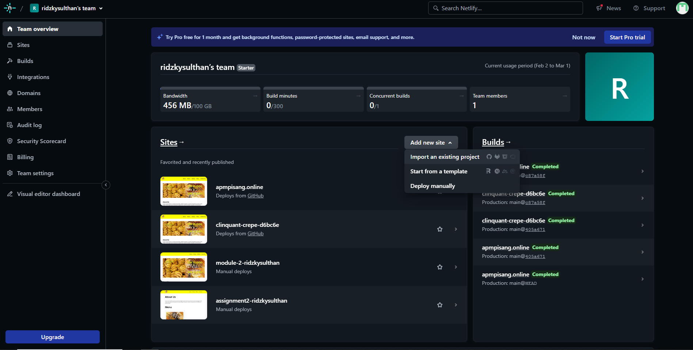

# Assignment Ridzky Sulthan

Selamat datang di website yang berisi latihan dasar membuat HTML,tujuan dibuatnya website ini yaitu agar saya bisa latihan ngoding  dan mendapatkan nilai untuk Assignment .

## 🖥 Teknologi yang Digunakan
  Website ini dibangun menggunakan berbagai teknologi, yaitu sebagai berikut:
| Teknologi       | Keterangan                                                                                        |
|-------------------|-------------------------------------------------------------------------------------------------|
|                         | Digunakan untuk membuat struktur dasar situs web.                                 |
|                            | Digunakan untuk mempercantik tampilan website                                     |
|      | Digunakan agar website lebih interaktif                                           |

<!-- ## 🎁 Fitur Utama di website ini

- Website ini sudah menggunakan custom font yang embed dari google dengan nama "Sora" dan penulisan cover gambar menggunakan shadow.

- Website ini sudah tablet dan smartphone friendly.

- Sudah menggunakan fitur animation. -->

<!-- 
- ini merupakan tampilan untuk mengirim pesan. -->

## Cara Deploy dengan Domain Dendiri

### Register Netlify dan Connect dengan account Github

Login dengan Github agar terhubung langsung dengan reponya 

  

### Add project

Add project melalui Github 

  

### Select Project

Mengganti project mejadi RevoU dan pilih repo yang ingin di deploy 

  

### Deploy Repository

Deploy Repo yang sudah ada 

  

### Membeli Domain

Membeli domain di website [niagara](https://www.niagahoster.co.id/) atau diwadah lainnya 

  

### Setting Domain

Jika sudah selsia transaksi balik ke web Netlify dan ke section domain management selanjutnya copy semua domain 

  

### Setting Domain di Niagara Hoster

Masukan Domain di server niagara hoster 

  

### Website sudah Lunch

Website sudah bisa dibuka dengan domain sendiri 

  

## 🌐 Link Web
https://apmpisang.online/